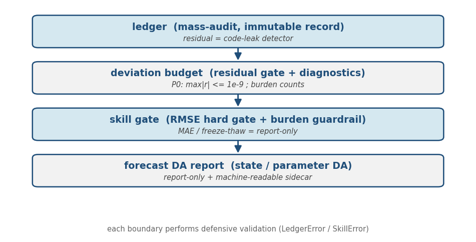
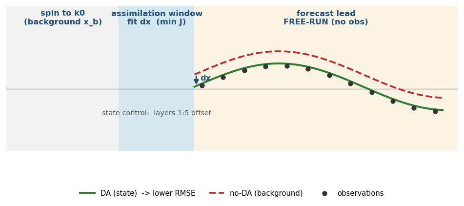
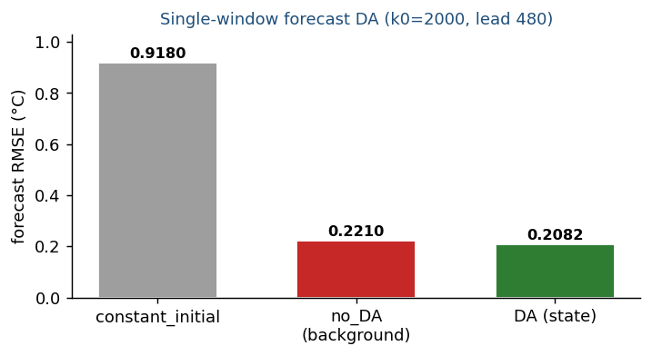
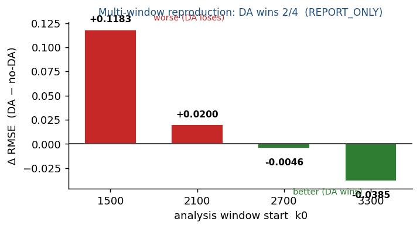

# dROAD 기술보고서 및 사용자 매뉴얼

> **Version**: v1.0
> **Date**: 2026-07-06
> **Content basis (repository commit)**: `a9f635f` (origin/main)
> **Generated artifacts**: [`dROAD_기술보고서.docx`](../../dROAD_기술보고서.docx), [`dROAD_기술보고서.pdf`](../../dROAD_기술보고서.pdf)
> **Build**: `python docs/report/figures/make_figures.py && node docs/report/build_docx.js`
> **Status**: research prototype · forecast DA는 **report-only milestone**

이 Markdown이 보고서의 **source of truth**다. DOCX/PDF는 이 문서와 그림에서 생성되는 산출물이며, 내용 리뷰·diff·재현은 이 파일 기준으로 한다.

---

## 1. Executive summary

dROAD는 FMI RoadSurf 노면기상 모델을 파이썬으로 재구현하되 핵심 열·질량 과정을 **미분가능(JAX)**하게 만들어, 관측으로 초기상태·파라미터를 역추정하는 자료동화(DA)를 가능케 하는 연구 프로토타입이다. 두 번째 축은 **질량 감사(mass-audit) 레이어**로, "수치적으로 맞는가(잔차)"와 "물리적으로 신뢰할 수 있는가(진단·skill)"를 별도 게이트로 판정한다.

핵심 성과: (1) `ledger → deviation budget → skill gate → forecast DA`로 이어지는 일관된 검증 파이프라인, (2) 파라미터 DA와 상태추정 DA의 명확한 분리, (3) 단일 window의 상태-DA 개선을 다중 window에서 재검증해 과대주장을 방지한 점.

**가장 중요한 한 문장**: dROAD는 audit/deviation/skill/forecast-DA 평가 레이어를 갖춘 연구 프로토타입이며, state forecast DA는 **단일 window에서 개선 신호**를 보였지만 **multi-window에서는 2/4만 개선되어 report-only 단계**다.

## 2. Scope and non-goals

- **Scope**: dry thermal + storage/phase 결합 모델(NumPy 정밀 경로), dry 열모델의 미분가능 경로(JAX), 질량 감사·deviation·skill·forecast DA 평가 레이어, report-only 실험.
- **Non-goals (현 단계)**: operational 배포, full-model(storage 포함) DA, 독립 station/day 다중 case 기반 promotion, 통계적 유의성 주장.

---

## 3. 시스템 아키텍처

4개 레이어가 계약(contract)으로 연결된 파이프라인이며, 하위 감사 출력이 상위 게이트의 검증된 입력이 된다. 각 경계에서 방어적 검증(`LedgerError`/`SkillError`)을 수행한다.



**모듈 구성 (`droad/`, 17개 코어, ~2,836 LOC)**

| 계층 | 모듈 |
|---|---|
| 감사·게이트 | `ledger.py`, `deviation.py`, `skill_gate.py` |
| 물리(NumPy 정밀) | `thermal/boundary/radiation.py`, `storage.py`, `roadcond.py` |
| 결합·전체 rollout | `model.py`(step_full), `driver.py`(full_rollout) |
| 미분·변분 DA | `jax_model.py`, `jax_storage.py`, `smoothing.py`, `assimilate.py`, `dual.py` |
| 인프라 | `config.py`, `branches.py` |

**도구 (`tools/`, 9개)**: `report_deviation_budget`, `report_skill_gate`, `report_multiwindow_skill`, `report_da_evaluation`, `report_forecast_da`, `report_forecast_da_multi`, `analyze_forecast_da_regimes`, `check_raw_primitives`.

---

## 4. 수학적 정식화

### 4.1 Dry thermal model

노면 하부를 $N$개 층으로 이산화한 1차원 비정상 열확산. 노면온도는 상위 두 층 평균:

$$T_{\text{surf}} = (T_1 + T_2)/2$$

표면 순복사속($\alpha$ 알베도, $\varepsilon$ 방사율, $\sigma$ Stefan–Boltzmann):

$$R_{\text{net}} = (1-\alpha)\,SW + \varepsilon\,LW - \varepsilon\,\sigma\,(T_{\text{surf}}+273.15)^4$$

지중 열유속(표면·층간)과 명시적 유한체적 시간전진($C_{\text{vsh}}$ 온도의존 체적 열용량):

$$G_0 = R_{\text{net}} - LE + Q_{\text{tr}} + h_{\text{BLC}}(T_0 - T_1), \qquad G_j = -\tfrac{CC}{DyK_j}(T_{j+1}-T_j)$$

$$T_j^{n+1} = T_j^{n} + \Delta t\,\text{capDZ}_j\,(G_j - G_{j-1}), \qquad \text{capDZ}_j = -\tfrac{1}{DyC_j\,C_{\text{vsh}}}$$

경계층 전도도 $h_{\text{BLC}}$는 Monin–Obukhov류 안정도 보정을 40회 고정점 반복으로 푼다. 잠열속 $LE$는 포화수증기압 차 기반. Kelvin 하한·분모 보호·지수 클립으로 미선택 분기의 그래디언트를 유한하게 유지한다.

### 4.2 질량 보존 불변식 (ledger residual)

각 저장소(눈·물·얼음·퇴적)의 스텝별 수지. $S_{\text{ext}}, K_{\text{ext}}$는 외부 유입·유출, 내부 전이는 net 0이라 잔차에 포함하지 않는다:

$$M_{\text{after}} = M_{\text{before}} + S_{\text{ext}} - K_{\text{ext}}, \qquad r = M_{\text{after}} - (M_{\text{before}} + S_{\text{ext}} - K_{\text{ext}})$$

**$r \approx 0$은 물리가 아니라 코드 정합성(누출 탐지)을 뜻한다.** 병합 시 자식 잔차를 합산하지 않고 각 자식이 개별적으로 $|r|\le$ atol이며 연속성($M_{\text{after}}^{(i)} = M_{\text{before}}^{(i+1)}$)을 만족해야 한다. **P0 게이트**: $\max_t |r_t| \le 10^{-9}$.

### 4.3 Deviation budget

rollout 감사 트레일을 잔차(P0)·진단 코드별 카운트·`max_storage_jump`(원본 rollout step provenance)로 집계한다. **진단(over-melt/overflow/negative-pre-clamp)은 실패가 아니라 참조 물리 특성의 발생 빈도**다. `steps=` 슬라이스로 holdout 구간만 집계해 skill window와 물리부담 window를 정렬한다.

### 4.4 변분 자료동화 (forecast DA)

일반 4D-Var:

$$J(x_0) = \tfrac12(x_0-x_b)^\top B^{-1}(x_0-x_b) + \tfrac12\sum_t (H M_t(x_0) - y_t)^\top R^{-1}(\cdot)$$

dROAD **상태추정 forecast DA** 구현형 — 제어변수 = near-surface 상태보정 $dx$(layers 1:5 offset), 배경항 = $bg_w\lVert dx\rVert^2$, 관측항 = 동화창 가중 MSE($H(T)=(T_1+T_2)/2$, $\oplus$ = layers 1:5 가산):

$$J(dx) = \frac{1}{\sum w_t}\sum_t w_t\,\big(H M_t(x_b \oplus dx) - y_t\big)^2 + bg_w\,\lVert dx\rVert^2$$

그래디언트 $\nabla_{dx}J$는 역방향 자동미분(VJP/adjoint) **단일 패스**로 계산되어 비용이 제어차원과 무관하다. 최적화는 Adam(best-iterate) 또는 Gauss–Newton $(J_r^\top J_r + \lambda I)\delta z = -J_r^\top r$ (matrix-free CG). 분석상태는 동화창 끝에서 carry 후 **관측 미삽입 자유예보**로 lead를 적분해 no-DA(background)와 비교한다.



### 4.5 평가 메트릭

$$\text{RMSE}=\sqrt{\tfrac1n\sum(p_i-o_i)^2}, \quad \text{degradation}=\frac{\text{RMSE}_{\text{holdout}}}{\text{RMSE}_{\text{train}}}$$

skill 게이트 hard 조건(부등식): $c_{\text{rmse}} \le b_{\text{rmse}}(1+f)$, $r \le$ atol, $c_{\text{rate/om/of}} \le b_{\text{rate/om/of}} + \Delta$. 이 세 물리부담은 `diagnostics_delta().physics_worse`가 보는 항목과 일치한다. regime 분리도 $\text{sep} = |\mu_{\text{win}}-\mu_{\text{lose}}| / \max(|\mu_{\text{win}}|,|\mu_{\text{lose}}|,\epsilon)$는 부호가 반대이면 1을 넘을 수 있고 **통계적 유의성이 아니다**.

---

## 5. Validation and experiments

> 실험 결과 기준 리포트: `reports/deviation_budget_baseline.md`, `reports/skill_gate_baseline.md`, `reports/multiwindow_skill.md`, `reports/da_evaluation.md`, `reports/forecast_da.md`, `reports/forecast_da_multi.md`, `reports/forecast_da_regimes.md`. 코어 187 + JAX 34 테스트 통과, raw-primitive 감사 clean.

### 5.1 질량 감사 기준선
최대 primary 잔차 ≈ 0 (≈4.4e-16, PASS). 진단 negative-pre-clamp 56회(실패 아님, 참조 물리). 최대 storage jump = Ice, step 4312, +0.1006.

### 5.2 예보 skill 기준선

| 모델 | RMSE(°C) | freeze-thaw | 게이트 |
|---|---|---|---|
| constant_initial | 5.0432 | 0.2766 | baseline |
| default | 0.2049 | 0.9915 | PASS |

다중창(6기간) default는 6/6에서 constant_initial을 이김(RMSE 평균 0.187/최악 0.344). 단일 fixture이므로 promotion **REPORT_ONLY**.

### 5.3 파라미터 민감도 DA (홀드아웃)

| 모델 | RMSE(°C) | vs default |
|---|---|---|
| default (Emiss 0.950) | 0.1494 | baseline |
| DA (Emiss 0.995) | 0.1555 | **FAIL** |

cal/eval window 분리 시 DA-보정 Emiss는 default보다 홀드아웃 RMSE가 나쁘다(Δ +0.0061). 단일창 equifinality의 한계. (참조 1-step persistence RMSE 0.0078은 게이트 baseline 부적합.)

### 5.4 상태추정 forecast DA (단일 window)

| 모델 | 예보 RMSE(°C) | gate vs no-DA |
|---|---|---|
| constant_initial | 0.9180 | baseline |
| no_DA (background) | 0.2210 | baseline |
| DA (state) | 0.2082 | **PASS** |

초기상태 동화가 자유예보를 개선(Δ −0.0128, degradation 0.954). "DA가 default를 못 이긴다"던 이전 결론은 DA 자체가 아니라 **파라미터 equifinality**의 한계였음을 분리.



### 5.5 다중 window 재현 검증

| k0 | DA RMSE | BG RMSE | Δrmse | DA 우위 |
|---|---|---|---|---|
| 1500 | 0.6431 | 0.5248 | +0.1183 | False |
| 2100 | 0.2313 | 0.2113 | +0.0200 | False |
| 2700 | 0.4580 | 0.4626 | −0.0046 | True |
| 3300 | 1.1007 | 1.1392 | −0.0385 | True |

**단일 window 성공은 재현되지 않는다.** DA는 4개 중 **2개에서만** no-DA를 이기고 평균 Δrmse +0.0238(악화). promotion **REPORT_ONLY**이며 사유는 "케이스 부족"이 아니라 "모든 window를 이기지 못함". window는 독립 case가 아니므로 promotion은 `n_cases=1`로 판정.



### 5.6 win/lose regime 분석 (N=4, case-study)

feature를 4 family(ex-ante forcing / post-hoc obs / background-fit / DA-response)로 분리. **ex-ante forcing** 기준 win group은 평균적으로 더 낮은 `tair_mean`(−0.02 vs +0.84), 더 높은 `sw_mean`(28 vs 0.06), 더 낮은 `is_night_fraction`(0.31 vs 0.69) 쪽으로 치우친다. **다만 window별 예외가 있고(win k0=2700은 야간 비중 0.63) N=4이므로 인과 규칙이 아니라 다음 grid의 탐색 prior다.** `dx_*`는 DA 자체 보정(내생적)이라 원인이 아닌 결과.

---

## 6. 사용자 매뉴얼

**설치**: `pip install -e .[dev]` (JAX·optax 포함).

**검증**: `pytest -m "not jax"` (코어 187), `pytest -m jax` (34), `python tools/check_raw_primitives.py` (clean=통과).

**리포트 실행**:
```
python tools/report_deviation_budget.py
python tools/report_skill_gate.py
python tools/report_multiwindow_skill.py
python tools/report_da_evaluation.py --max-steps 4000
python tools/report_forecast_da.py [--k0 --window --lead --bg-w]
python tools/report_forecast_da_multi.py [--windows N]
python tools/analyze_forecast_da_regimes.py
```

**출력 해석**: 잔차 ~0(코드 정합성) · 진단은 카운트(실패 아님) · `gate_vs_bg/default`는 RMSE hard 판정 · `degradation_ratio`>1은 overfit 또는 lead가 더 어려운 구간 · promotion 단일 fixture는 항상 REPORT_ONLY · `_meta.json`은 게이트·window·holdout 부담을 재현 가능하게 보존.

**forecast DA 파라미터**: `--k0`(분석 시작), `--window`(동화창), `--lead`(예보 lead), `--bg-w`(배경 정규화·overfit 억제).

---

## 7. Limitations

- **dry forecast DA에는 storage/deviation audit이 적용되지 않는다**(dry 모델은 storage를 진행하지 않음; skill-only 게이트).
- 현재 증거는 **단일 fixture / 다중 window** 뿐이다. 독립 station/day case가 확보되기 전까지 **일반화 성능으로 주장하지 않는다.**
- state forecast DA는 단일 window에서 개선, **multi-window 재현성은 2/4로 부족** → promotion 불가(REPORT_ONLY).
- parameter DA와 state DA는 **다른 실험**이며 결과도 상반(파라미터 DA는 default 대비 FAIL).
- **residual은 코드-회계 누출 탐지기**이지 물리 타당성 점수가 아니다. **diagnostics는 물리/deviation 신호**이지 회계 실패가 아니다.
- regime 분석은 **N=4 hypothesis generator**이며 통계적 유의성이 없다.

## 8. Roadmap

1. `bg_w × window × lead` 축소 grid — ex-ante forcing 신호를 prior로, post-hoc은 사후 설명으로, dx·degradation은 튜닝 결과로만 해석.
2. full-model 확장 설계(dry $dx$를 full 모델 열상태에 주입 → storage/phase 포함). 이때 deviation_budget 감사가 다시 핵심.
3. 독립 station/day/weather case manifest(`cases.yaml`) → promotion_gate 실사용.
4. case 확보 후 forcing regime과 DA 이득의 통계적 검증.

---

## 부록 A. 기호 정의 (Nomenclature)

| 기호 | 의미 | 단위·비고 |
|---|---|---|
| $T_{\text{surf}}, T_j$ | 노면온도, j층 온도 | °C |
| $\alpha, \varepsilon, \sigma$ | 알베도, 방사율, Stefan–Boltzmann | – / – / W·m⁻²K⁻⁴ |
| $R_{\text{net}}, LE$ | 순복사속, 잠열속 | W·m⁻² |
| $h_{\text{BLC}}, C_{\text{vsh}}$ | 경계층 전도도, 체적 열용량 | – / J·m⁻³K⁻¹ |
| $\Delta t$ | 시간 스텝 | 30 s |
| $M, H$ | 모델 전파, 관측 연산자 | – |
| $S_{\text{ext}}, K_{\text{ext}}, r$ | 외부 유입·유출, 질량잔차 | mm 수당량 |
| $x_0, x_b, dx$ | 초기·배경 상태, 상태보정 | °C (layers 1:5) |
| $B, R, J$ | 배경·관측 공분산, 비용함수 | – |
| $bg_w, \lambda, \Sigma$ | 배경 정규화, damping, Laplace 사후공분산 | – |

## 부록 B. 재현 절차 및 파일 구조

**재현**: 설치 → `pytest -m "not jax"`(187 통과) + 감사 clean → §6 도구 실행 → `reports/` 산출물이 §5 수치와 일치.

```
dROAD/
├─ droad/      # 17개 코어 모듈 (~2,836 LOC): 감사·물리·결합·미분/DA
├─ tools/      # 9개 리포트/분석 도구 + check_raw_primitives
├─ tests/      # 27개 파일 (코어 187 + jax 34 = 221)
├─ reports/    # 리포트 계열 (.md / .csv / _meta.json)
└─ docs/report/
    ├─ dROAD_report.md        # ← source of truth (이 문서)
    ├─ build_docx.js          # DOCX 생성기
    ├─ figures/make_figures.py + *.png
    └─ README.md
```

**커밋 이정표**: `688b8c3`(진짜 forecast DA) · `867e100`(다중 window 재현·REPORT_ONLY) · `a9f635f`(regime 4-family). 본 문서는 `a9f635f` 코드 상태를 기술한다.
