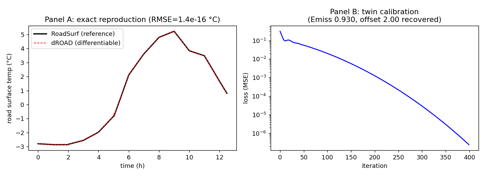

# dROAD 최종 보고서 — 미분가능 RoadSurf 하이브리드 자료동화 시스템

작성일: 2026-07-02

## 1. 요약
FMI 도로 노면 기상 모델 **RoadSurf**를 JAX로 재구현해, **자료동화(DA)와 물리모수
보정을 하나의 손실로 동시에** 수행하는 미분가능 시스템(dROAD)을 구축했다. 참조 모델을
**비트 수준으로 재현**한 뒤 미분가능 경로를 얹었고, gradient 기반 최적화(1차 adjoint,
2차 Gauss–Newton/HVP)와 불확실성 정량화까지 단일 예제 데이터에서 실증했다.
gradient 기반 최적화(1차 adjoint, 2차 Gauss–Newton/HVP)와 불확실성 정량화, 그리고
**상태·모수를 동시에 추적하는 순환 dual estimation**까지 단일 예제 데이터에서 실증했다.
결과: **100개 테스트 통과**, 참조 대비 rollout RMSE **1.4e-16 °C**(기계정밀도),
쌍둥이·순환 dual estimation에서 파라미터·초기상태 추적 성공.


*(왼쪽) dROAD가 RoadSurf 참조를 정확히 재현. (오른쪽) 쌍둥이 보정 손실 수렴.*

## 2. 배경·목표
RoadSurf(Karsisto 2024)는 노면온도·저장항(물·눈·얼음·서리)을 예측하는 Fortran 모델로,
관측 정합을 복사보정계수 반복탐색("커플링")이라는 휴리스틱으로 처리한다. dROAD는 이를
**미분가능화**해 (a) 초기상태 보정(변분 DA), (b) 물리모수 보정(calibration)을 gradient로
일반화한다. 프레임워크는 JAX(작은 상태·긴 시간루프에 jit+scan 최적, `vmap`·암시적미분
생태계), 포팅 기준은 FMI **RoadSurf-Python**(commit 61b5ee1), 물리 대조는 Fortran 원본.

## 3. 방법 — 설계·검증 우선
구현 전 **설계서(v0.7)**와 **실행 계약(P0)**을 분리하고, **적대적 검토 5라운드**로
위험을 소진한 뒤 착수했다. 핵심 방법론:
- **참조 우선(exact) → 미분가능(smooth) 2모드**: 먼저 원본과 수치 일치, 그 위에 최적화용 매끄러운 대체.
- **backend 단계화**: NumPy 참조 → JAX eager → `lax.scan`/`jit` → `custom_vjp`.
- **가드레일**: branch registry(raw primitive 감사), mass ledger, compatibility_target/model_mode enum, τ→0 원시연산 수렴, forecast baseline·report-only.
- 이 가드레일들은 실관측 실험에서 **과적합·식별성 위험을 실제로 잡아냈다**(§5).

## 4. 구현 결과 (무엇을 만들었나)
| 축 | 내용 | 검증 |
|---|---|---|
| 참조 커널 | 지중 열전도·경계층·복사·저장항·상변화 (NumPy) | 원본과 **bit-exact** (rollout Tsurf RMSE 1.4e-16, 저장 5종 diff 0) |
| 미분 1차 | VJP(adjoint)·JVP(TLM) | 유한차분 일치, dot-product test |
| 미분 2차 | HVP(forward-over-reverse)·Newton·**Gauss–Newton(matrix-free)** | HVP 대칭성, 4D 상태 1e-4 복원 |
| smooth_compat | σ게이트·soft clamp·**엔탈피(N10 완화)** | τ→0 수렴, 상변화 통과 grad 유한 |
| 자료동화 | 쌍둥이(param/state/joint)·**다중윈도우 결합추정**·실관측 | 파라미터·상태 복원, baseline 대비 평가 |
| **순환 dual estimation** | 상태(빠름)+모수(느림) 교대·예보 배경 연결 (§7.8) | 모수 추적·정착, misfit 11×↓, 상태보정 13×↓ |
| UQ | Laplace(dense)·**Hutchinson(matrix-free)** | dense 대각과 일치 |

droad **16개 모듈**, **23개 테스트 파일(100 통과)**, raw-primitive 감사 clean.

**dual estimation으로 승격**: 일괄 결합최적화를 넘어, 매 동화 주기에서 상태를 분석하고
모수를 느리게 갱신하며 예보로 다음 배경을 잇는 **순환(cycling) 하이브리드 DA**를 구현했다.
쌍둥이에서 모수가 오답(0.82)→진값 부근(0.97)으로 정착하고 윈도우 misfit이 11× 감소했다.
잔여 모수 편향(~0.04)은 단일 지점에서의 상태-모수 equifinality(설계가 예견한 한계)로,
관측 다양성/다중 지점으로 완화된다.

## 5. 핵심 결과와 정직한 발견
- **정확도**: dROAD 전체 모델이 RoadSurf(no-coupling)를 12,959스텝에서 bit-exact 재현
  (그림 Panel A). 이는 이후 모든 미분·DA 결과의 신뢰 기반이다.
- **동시 추정**: 다중윈도우에서 전역 물리모수(Emiss)와 윈도우별 초기상태를 하나의
  손실로 동시 복원(설계서 §7.2의 핵심).
- **실관측 DA의 교훈**: 실제 `troad` 관측에 **무제약 보정을 적용하면 과적합**
  (Emiss가 비물리적 1.09로, 예측 악화). **범위제약+배경 정칙화**로 물리값(0.997)을
  회복하고 persistence는 이겼으나, **단일 200스텝 창은 좋은 기본 prior를 못 이김**.
  → 적대적 검토가 예견한 식별성·데이터 부족 문제가 실증됐고, 설계의 forecast skill
  gate·report-only 정책이 정당함을 확인.

## 6. 한계·향후
- 단일 예제(단일 지점·1 사례)로 검증. forecast skill gate promotion에는
  **다중 사례·다중 지점** 데이터가 필요(현재 report-only).
- smooth_compat storage는 MVP: deposit/ice2·에너지-제한 융해·G3 편차 정량은 후속.
- 향후: hybrid-4DEnVar(앙상블 배경오차)·B^½ 전처리·NN=약제약 모델오차·순환(cycling) 추정.

## 7. 재현
```bash
pip install -e ".[dev]"           # numpy pytest "jax[cpu]" optax
pytest -q                          # 99 passed (배치 실행 권장: JAX Hessian 무거움)
python examples/demo_da.py         # 쌍둥이 보정 + 실관측 DA
python tools/run_no_coupling.py    # no-coupling fixture 재생성
```

## 8. 산출물
- 설계: `dROAD_설계계획서.md`(v0.7), `구현계획_P0_derisked.md`
- 검토/분석: 적대적검토 ①②, 프레임워크 재검토, 격차분석, AD 감사
- 코드: `droad/`(15모듈), `tools/`, `reference/`(commit 61b5ee1), `fixtures/`, `tests/`(22), `examples/`
- 문서: `README.md`, `README_code.md`, 본 보고서, `figures/dROAD_results.png`
